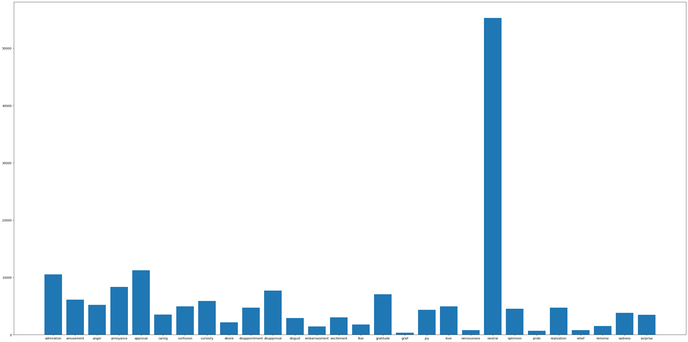
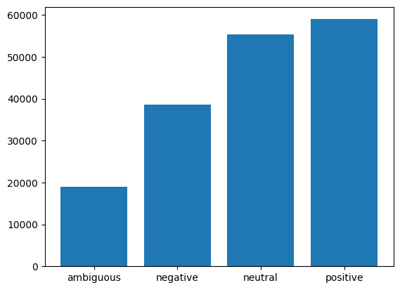
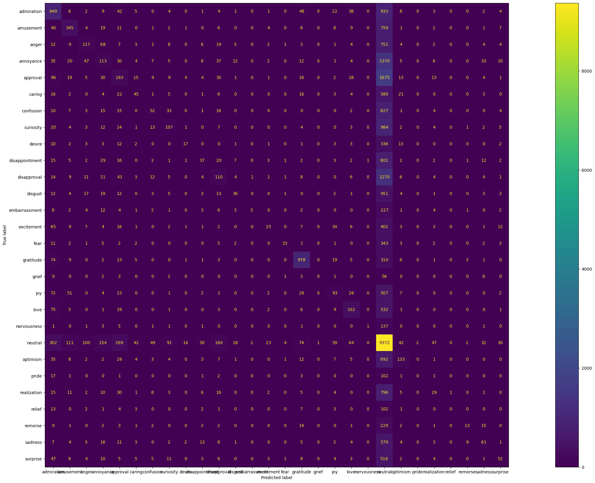
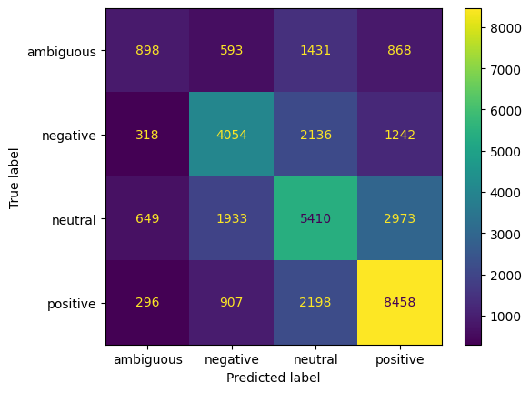

# Part 4 - Analysis
In this part we will analyze the results of the project.
## 4.1 - Dataset Analysis

To better analyze our data, let us look at it in parts.

### Emotions



Let us first look at the dataset of emotions and analyze the information present.

By looking at the bar-graph we can tell that emotions are not evenly distributed amongst the posts. In fact, the "neutral" emotion is by far the most common at over 50,000 instances. Whereas all other emotions barely surpass 10,000 if they even get close. This can severely affect our accuracy.

Besides the uneven distribution of emotions in our data, there is an intrinsic problem with the data classification itself. The current database assumes that emotions can be neatly categorized into buckets, but that is not the case in real life. Emotions tend to be very complex and we can feel multiple emotions at once. It's entirely possible for a post to invoke both "joy" and "curiosity". Similarly, some emotions blend into one another. "Anger" and "annoyance" can be very similar emotions. As can "sadness" and "grief". How does our dataset distinguish this information in a meaningful capacity? Because the lack of distinction simply blends a lot of information together, giving us a messy result.

### Sentiments



The distribution of the sentiments is much more even than that of our emotions. That said, there are still some problems.

While the two largest values ("neutral" and "positive") have similar proportions. The "negative" sentiment has roughly 3/4ths  of their proportions. The "ambiguous" sentiment is even worst at under half the proportion of the others. Therefore we again lack an even distribution.

Furthermore, there's again the issue of semantics. While "positive" and "negative" are easy to understand, what about "neutral" and "ambiguous"? These two categories seem very semantically similar, so our data classification is flawed. Especially since there are so few classes.

## 4.2 - Result Analysis

### Metrics

By looking at the general performance of all our models, we can tell the accuracy and macro f1 scores are very low in all cases.
```
EMOTIONS:
            BMNB    BDT    BMLP    TMNB    TDT    TMLP    EBMLP    ETMLP			
accuracy    0.38    0.36   0.43    0.39    0.37   0.43    0.39     0.39
macro f1    0.16    0.27   0.24    0.22    0.27   0.26    0.18     0.18

avg accuracy		0.3925
avg macro f1 		0.2225

```

```
SENTIMENTS:
            BMNB    BDT    BMLP    TMNB    TDT    TMLP    EBMLP    ETMLP			
accuracy    0.55    0.55   0.57    0.55    0.55   0.56    0.51     0.50
Macro F1    0.50    0.53   0.53    0.50    0.53   0.51    0.47     0.47

avg accuracy		0.5425
avg macro f1 		0.505

```

### Accuracy Versus Macro F1

First let us note the discrepancy between the accuracy and macro f1 scores for the emotions. The average accuracy is almost double that of the average macro f1 score.

This lines up with the analysis made in part 4.1, where we noted that the classes of the emotions were very imbalanced. This means the accuracy is a poor metric in this instance so we will be relying on the macro f1 scores.

We also notice that this discrepancy exists in the sentiments as well, but to a much smaller degree. This is due to the same reason as the above and as was mention in part 4.1, since our "ambiguous" class has too few instances which leads to imbalance.

### Low Scores - Emotions

The very low scores in our models indicate a fundamental problem with the design and implementation of the AI and the dataset.

As we can see in the emotions table, the macro f1 score is around 25%. This suggests the model is incredibly ineffective at correctly labeling the Reddit posts.



Looking at the confusion matrix of our Base Multinomial Naive Bayes model we see tit has a tendency of over-predicting "neutral". This undoubtedly stems from the fact that our dataset is extremely unbalanced, resulting in a poor performance. We can see a similar pattern in other confusion matrices as well.

As mentioned in 4.1, I believe another reason for the poor performance is the ambiguity around our classes. Semantically, it is difficult to categorize a statement into one of several emotions when the text could display several of them. This is made increasingly difficult by the very nature of written text, as they often fail to accurately portray the emotions of the writer (which is often the cause of professional misunderstandings).

This problem is made worse by some of our posts having only a handful of words in them. Meaning we cannot gather enough information to properly categorize them.

### Low Scores - Sentiments

Although our sentiments have higher scores than the emotions, they are still much smaller than we would like.



As we can observe in the case of the Base Multinomial Naive Bayes model, oru confusion matrix is much more evenly distributed. This again follows the pattern predicted in part 4.1.

Notice how the cases of over estimation correlate with the largest classes. The "ambiguous" class was under estimated due to its comparably low presence in our original dataset.

The results so far indicate that we can improve our AI models by processing our dataset so all classes have a similar proportion.

### Comparing Models

Looking at the macro f1 scores of the different models, we observe an interesting pattern.

In the base case (default parameters), we notice that the Naive Bayes Model underperforms both the Decision Tree and Multi-Layered Perceptron models (both of which have similar results).

In the top case (best parameters), the same pattern as the base case continues. But all models see a slight increase in their performance.

The reason for the low Naive Bayes Model score is likely the sparse nature of our vectorized posts. Since most words in our vocabulary will have a count of 0 per post, there will be a lot of small numbers when calculating the probabilities. This increases the likelihood of underflow problems which negatively affect our results. The other two models are more resistant to underflow problems and are not affected by sparse matrices as much.

### Comparing Count Vectorization And Embeddings

If we compare count vectorization and embeddings, we notice a clear decrease in the embedding scores. The reason for this is likely a combination of the hit-rate and the dimensions of the vectors.

We observed a hit-rate of around 85% for our embeddings, which means on average we consider only 85% of the words in a post. Meaning we have less information to work on compared to count vectorization which uses 100% of the words in a post.

In the case of embeddings, we are also using vectors of size 300 compared to 30,000 in the case of count vectorization. This could be a loss of information for the models, even though the vectors now carry semantic meaning.

## 4.3 - Teamwork
This project was a solo endeavour, so I was responsible for all tasks.


